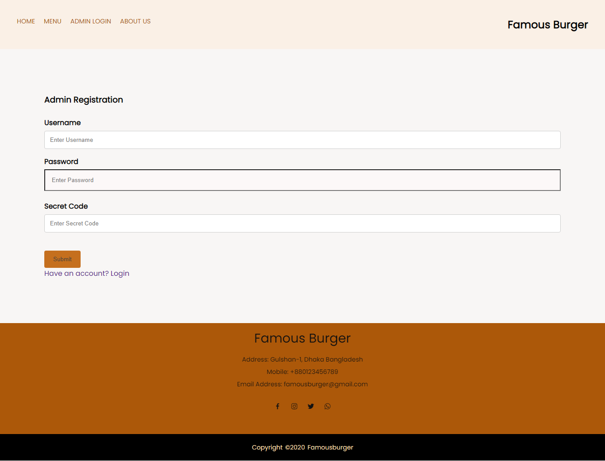
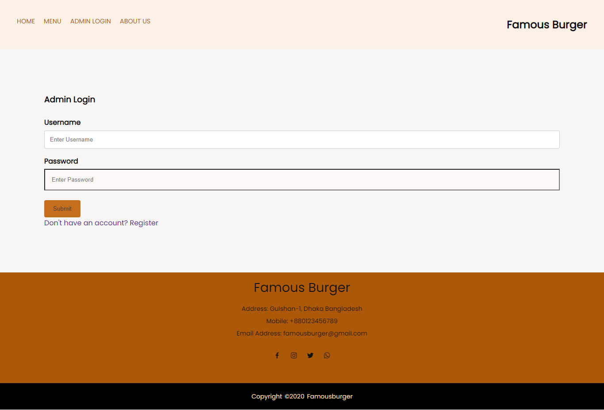
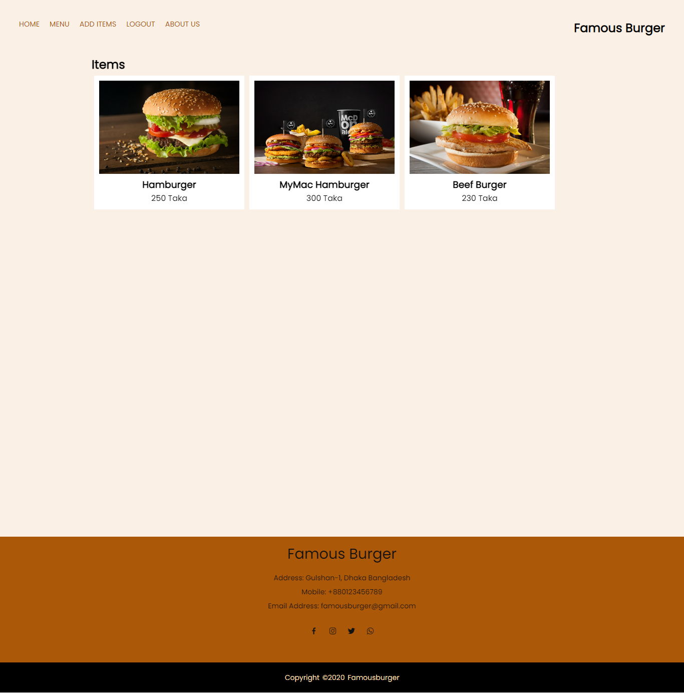

# Welcome to our website

# Topic - Famous Burger

## To get started with the project
### 1. In Terminal type:

```git
npm install
```

### 2. Create .env and type:

```git
PORT=5000
```

### 3. To run the server type:

```git
npm run dev
```

### 4. In browser type **_localhost:5000_** to dispay the index page

<br>


# USER INTERFACE

## 1. Registration Page

 This is the registration form where Admin can create an account. The admin need to know a secret code for creating the account.
*The secret code is 666*



## 2. Login Page

Every time after initial registration, one will log on to the system using the username and password one has created.



## 3. Customer Home Page

This page serves as the starting point of the website. It is the default webpage that loads when a customer visits the website.


## 4. Admin Home Page

It is the default webpage that loads when the admin logged in to the system.


## 5. Add items Page

The admin needs to fill-up this item form to add new items to the menu page on the website.


## 6. Menu Page

 This page is a list of food and beverages which are offered to customers. 



## 7. About us Page


<br>

# *The website is responsive**